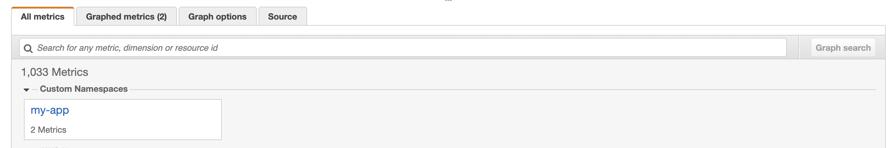

# lambda-emf-demo

Demo of using AWS Lambda with the Embedded Metric Format support from CloudWatch

To run this demo:

1. run `npm install`
2. run `npm run sls -- deploy` to deploy the demo app, you should see console output like the following

```
Serverless: Packaging service...
Serverless: Excluding development dependencies...
Serverless: Uploading CloudFormation file to S3...
Serverless: Uploading artifacts...
Serverless: Uploading service lambda-emf-demo.zip file to S3 (664.26 KB)...
Serverless: Validating template...
Serverless: Updating Stack...
Serverless: Checking Stack update progress...
..............
Serverless: Stack update finished...
Service Information
service: lambda-emf-demo
stage: dev
region: us-east-1
stack: lambda-emf-demo-dev
resources: 10
api keys:
  None
endpoints:
  GET - https://elkt42o0kf.execute-api.us-east-1.amazonaws.com/dev/
functions:
  hello: lambda-emf-demo-dev-hello
layers:
  None
Serverless: Run the "serverless" command to setup monitoring, troubleshooting and testing.
```

Curl the `GET` url to generate the metrics.

Now if you go to the Lambda console and you should find a function called `lambda-emf-demo-dev-hello` in the `us-east-1` region.

Check its logs and you should see a log message like this


As you can see, it records two custom metrics, `latency` and `count` in the namespace `my-app`.

Now head over to CloudWatch console, check under `Metrics` and you should see the custom namespace.



Clicking into it and you should see our two custom metrics and you can now plot them on graphs, and set up alarms against them.


